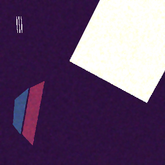

# NDSAR filters for multidimensional and single-channel SAR speckle filtering

Contents:

- [Description](#description)
- [Install](#install)
- [Usage](#usage)
- [Testing](#testing)

## Description

Python/C++ implementations of two speckle filters based on the nonlocal principle which can be applied to any type of SAR data (Polarimetric, Tomographic, Inteferometric, Multi-temporal, PolInSAR). 

- The **NDSAR-BLF** is a bilateral filter adapted to covariance matrices obtained from SLC multi-dimensional images.
- The **NDSAR-NLM** is a generalization of the previous method which computes similarities on square patches instead of individual pixels. It is more robust to speckle than the bilateral but requires more computational power, depending on the user selected patch size.

We also provide equivalent filters for **single channel** _i.e._ intensity images.

If you use one of these methods in your paper, please cite the following publication:

O. D'Hondt, C. López-Martínez , S. Guillaso and O. Hellwich.
**Nonlocal Filtering Applied to 3-D Reconstruction of Tomographic SAR Data.**
_IEEE Transactions on Geoscience and Remote Sensing, 2018, 56, 272-285_   

If you use only the NDSAR-BLF on PolSAR data, you may also cite:

O. D'Hondt, S. Guillaso and O. Hellwich. 
**Iterative Bilateral Filtering of Polarimetric SAR Data.** 
_IEEE Journal of Selected Topics in Applied Earth Observations and Remote Sensing,  2013, 6, 1628-1639_

For speed reasons, the core methods are implemented in C++, athough the API is in python.
This way you can easily use any data importer in python (PyRAT, GDAL...) and integrate our filters in your processing chain. 

**Important note:** when using the multidimensional versions of the filters with the affine invariant and log-euclidean distances, you first need to create a covariance matrix from the SLC data and apply a minimum amount of multi-looking so that the matrices are full-rank. For more information, please refer to the publication. The single-channel versions can be used directly on single-look intensities.

## Install

- Clone the repository in a folder contained in you python path.
- Build the module with `./cl_build.sh`

### Requirements

- numpy
- cython
- gcc
- openmp

## Usage

In your favorite python environment, import the filters with

```python
from ndsar import *
```

Then, type the name of the function followed by `?` to get help on how to use the function. Ex: `ndsarnlm?`. 

There are four available filters:

- `ndsarnlm`: nonlocal filter for covariance matrices (multi-dimensional SAR images)
- `ndsarblf`: bilateral filter for covariance matrices (multi-dimensional SAR images)
- `sarnlm`: nonlocal filter for intensity images  (single-channel SAR images)
- `sarblf`: bilateral filter for intensiity images  (single-channel SAR images)

### Remark

It is common practice in bilateral and nonlocal filtering to apply the methods in an iterative fashion. 
To do so in python, you first need to make a copy of your input data to ensure it will not be overwritten:
```python
fcov = cov.copy()
```
and run the filter inside a for loop:
```python
for _ in range(4):
  fcov = ndsarnlm(fcov)
```

## Testing

We provide an image of a simulated 4-look image polarimetric coherency matrices (covariances in the Pauli basis) to test the filters and get familiar with the parameters.

To load the image:
```python
import numpy as np
from ndsar import ndsarnlm
from ndsar.display import polcovshow

cov = np.load(path_to_package+'Simul_PolSAR.npy')
polcovshow(cov)
```
The following image should be displayed:


To apply the NDSAR-NLM filter:
```python
fcov = cov.copy()
N = 2
for _ in range(N):
    fcov = ndsarnlm(fcov, method = 'le', gs=2.8, gr=0.8 ,psiz=3)
polcovdisp(fcov)
```
The filtering result should look like:



which can be compared with the reference image called `Simul_PolSAR_Ideal.npy`.

If you use this dataset in your publication, please cite:

O. D'Hondt, S. Guillaso and O. Hellwich. 
**Iterative Bilateral Filtering of Polarimetric SAR Data.** 
_IEEE Journal of Selected Topics in Applied Earth Observations and Remote Sensing,  2013, 6, 1628-1639_


